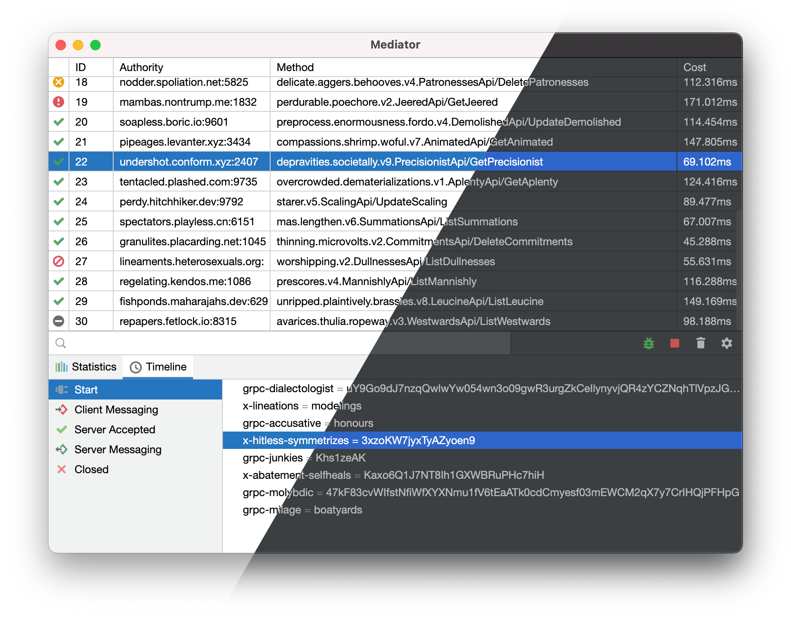
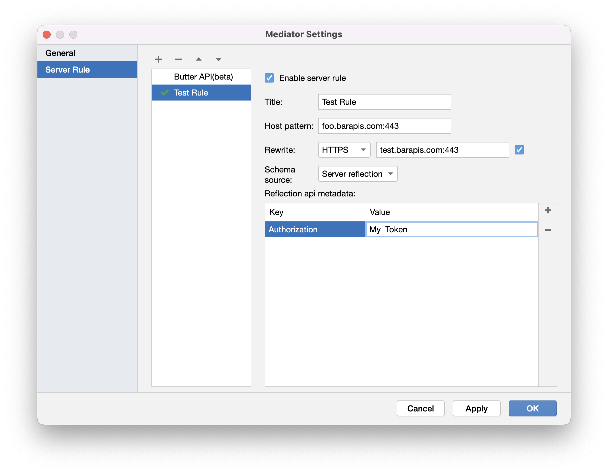
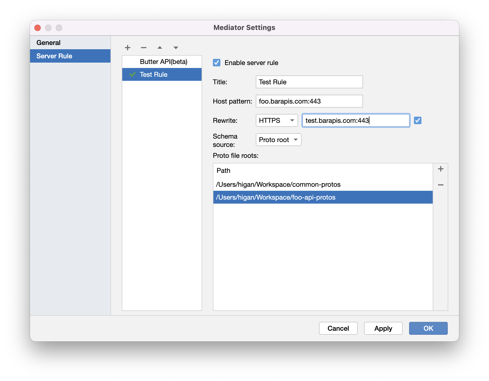
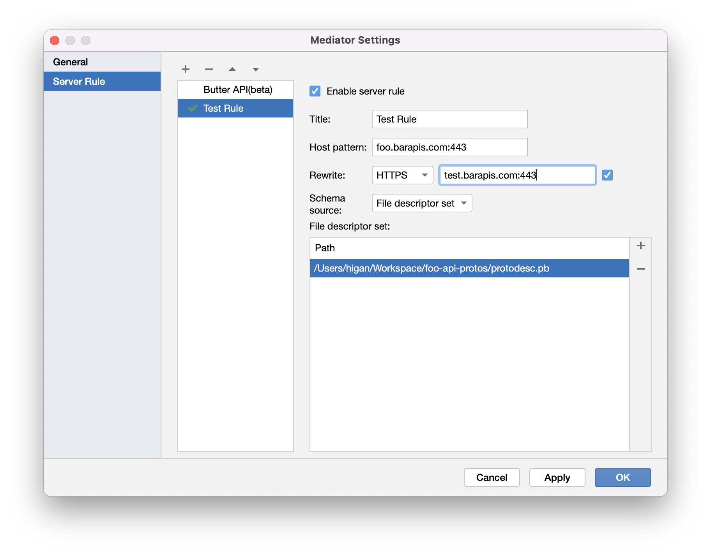

<h1 align="center">
<p>


</p>
<p>
<a href="https://github.com/grpc-ecosystem/awesome-grpc"></a>
<a href="https://www.jetbrains.com/lp/compose/"></a>
<a href="https://github.com/ButterCam/Mediator/releases"></a>
</p>
</h1>

Cross-platform GUI gRPC debugging proxy like [charles](https://www.charlesproxy.com/) but design for gRPC.

Build with [Netty](https://netty.io/) (proxy protocol), [Compose Desktop](https://www.jetbrains.com/lp/compose/) (GUI), [Sisyphus](https://github.com/ButterCam/sisyphus) (Protobuf Runtime)



## Highlight features

✅ **Cross-platform**, works on all your favorite platforms like Windows, macOS, Linux  
✅ **Jetbrains Style GUI**, easily integrating into your desktop  
✅ **Host Rewrite**, redirect the request to beta or test server without modifying client code  
✅ **Protobuf Decode Support**, parsing gRPC request and response message  
✅ **HTTPS Support**, decode gRPC/HTTPS requests

## Quick Start

### Install

Download distribution from [release page](https://github.com/ButterCam/Mediator/releases).

MSI for Windows, Dmg for macOS, Dmg(aarch64) for macOS(Apple Silicon), deb for Linux.

### Run

Open the mediator app, the proxy server will listen 8888 port by default.

### Config Client

Config the proxy server in your client code.

#### Java Client (Android or Server)

Config proxy server by `proxyDetector` method of channel builder.

```Kotlin
ManagedChannelBuilder.forAddress("foo.barapis.com", 9000)
    .usePlaintext()
    .proxyDetector {
        HttpConnectProxiedSocketAddress.newBuilder()
            .setTargetAddress(it as InetSocketAddress)
            .setProxyAddress(InetSocketAddress("<YOUR PC/MAC IP>", 8888))
            .build()
    }
    .build()
```

#### Objective C Client (iOS)

Set proxy server to Environment variable in `main` function before your app code.

```objc
int main(int argc, char * argv[]) {
    NSString * appDelegateClassName;
    @autoreleasepool {
        setenv("grpc_proxy", "http://<YOUR PC/MAC IP>:8888", 1);
        
        // Setup code that might create autoreleased objects goes here.
        appDelegateClassName = NSStringFromClass([AppDelegate class]);
    }
    return UIApplicationMain(argc, argv, nil, appDelegateClassName);
}
```

#### Go Client (Server)

Set proxy server to Environment variable.

```go
package main

import (
	"os"
)

func main() {
	os.Setenv("HTTP_PROXY", "http://<YOUR PC/MAC IP>:8888")

	// Your code here.
}
```

### HTTPS Support

Mediator will try to decode the gRPC/HTTPS request when server rule matched.

You need download the Mediator Root Certificate and install it to your client just like charles or fiddler.

The Mediator Root Certificate will be generated when you launch the Mediator app first-time.

You can download the Mediator Root Certificate by visit `http://<YOUR PC/MAC IP>:8888/mediatorRoot.cer`.

> Note:  
> To prevent abuse of the same root certificate, each Mediator installation generates a different root certificate.  
> You need reinstall the Mediator Root Certificate when you use different Mediator installation.

> Tips:  
> Mediator provide multi format of Root Certificate, you can choose the format you like.
> - `/mediatorRoot.cer` - DER format
> - `/mediatorRoot.crt` - PEM format
> - `/mediatorRoot.pem` - PEM format

#### Use Mediator Root Certificate for Java

By changing client code, you can eliminate the need to install certificates into the device.

With the `Grpc` utility class, you can pass the TrustManager to the Channel.

In this example, we trust all certificates, ignore all SSL error.

```Kotlin
val creds = TlsChannelCredentials.newBuilder().trustManager(object : X509TrustManager {
    override fun getAcceptedIssuers(): Array<X509Certificate> = arrayOf()

    @SuppressLint("TrustAllX509TrustManager")
    @Throws(CertificateException::class)
    override fun checkServerTrusted(chain: Array<X509Certificate>, authType: String) = Unit

    @SuppressLint("TrustAllX509TrustManager")
    @Throws(CertificateException::class)
    override fun checkClientTrusted(chain: Array<X509Certificate>, authType: String) = Unit
}).build()

// Do not call `useTransportSecurity()` method, when you create channel with TlsChannelCredentials.
Grpc.newChannelBuilder("$name:$port", creds)
```

You can also pass the specified certificate to the `trustManager` method of the `TlsChannelCredentials.Builder`.

#### Install Mediator Root Certificate for JDK

If you don't want to change client code, you can install the Mediator Root Certificate to your JDK.

JDK will not trust the Mediator Root Certificate by default even you install it to system.

You can find the JDK keystore file in `$JAVA_HOME/jre/lib/security/cacerts` or `$JAVA_HOME/lib/security/cacerts`.

Then import the Mediator Root Certificate to JDK cacerts file
by `keytool -import -keystore $JAVA_HOME/lib/security/cacerts -file mediatorRoot.cer` command.

#### Install Mediator Root Certificate for Android

If you don't want change your client code, you can install the Mediator Root Certificate to your device.

Download the Mediator Root Certificate in browser by visit `http://<YOUR PC/MAC IP>:8888/mediatorRoot.cer` on your
Android device.

Check [this guide](https://support.google.com/pixelphone/answer/2844832?hl=en) to install it to your device.

In Android 7.0 or later, you need config the networkSecurityConfig in `app/src/main/AndroidManifest.xml` to trust user
certificates.

```xml
<application
        android:name=".ApplicationClass"
        android:allowBackup="true"
        android:hardwareAccelerated="false"
        android:icon="@mipmap/ic_launcher"
        android:label="@string/app_name"
        android:largeHeap="true"
        android:networkSecurityConfig="@xml/network_security_config"
        android:supportsRtl="true"
        android:theme="@style/AppTheme">
```

With a corresponding `network_security_config.xml` in `app/src/main/res/xml/`:

1. Just trust user certificates in debug mode.

```xml
<?xml version="1.0" encoding="utf-8"?>
<network-security-config>
    <debug-overrides>
        <trust-anchors>
            <certificates src="user" />
        </trust-anchors>
    </debug-overrides>
</network-security-config>
```

2. Trust user certificates in release mode (Same as Android 6.0 and lower).

```xml
<?xml version="1.0" encoding="utf-8"?>
<network-security-config>
   <base-config cleartextTrafficPermitted="true">
      <trust-anchors>
         <certificates src="system" />
         <certificates src="user" />
      </trust-anchors>
   </base-config>
</network-security-config>
```

More information about
Android's [networkSecurityConfig](https://developer.android.com/training/articles/security-config).

#### Use Mediator Root Certificate for iOS

gRPC ObjectC client will not trust the Mediator Root Certificate by default even you install it to system.

You need pass the PEM format certificate to the `[GRPCCallOptions setPEMRootCertificates: cert]` method.

Download the PEM format certificate by `http://<YOUR PC/MAC IP>:8888/mediatorRoot.pem`.

### Resolve messages

Mediator can render the binary message into a JSON tree, when you have the API schema.

Mediator can accept API schema in many ways.

1. [Server Reflection](https://github.com/grpc/grpc/blob/master/doc/server-reflection.md), when your service supports
   server reflection, you can parse the binary message directly, and you can add additional request metadata for server
   reflection in the settings page.
2. proto Source Code, you can specify multiple proto root paths and Mediator will automatically compile the included
   proto source code into API schema.
3. FileDescriptorSet, you can specify multiple binary message files containing the API schema with the FileDescriptorSet
   structure.

#### Server Reflection

Before using this Schema source, please make sure your server
supports [Server Reflection](https://github.com/grpc/grpc/blob/master/doc/server-reflection.md).

1. Open the `Mediator Settings`, create a server rule for your server.
2. Enter the Regex in `Host pattern` input field which to match your server.
3. Choose the `Server reflection` schema source.
4. **Optional** Add the metadata in `Reflection api metadata` table.
5. Enable this rule by `Enable server rule` checkbox.



#### Proto roots

Mediator uses the protoc command to compile the proto file into a FileDescriptorSet message containing the API schema.

1. Open the `Mediator Settings`, create a server rule for your server.
2. Enter the Regex in `Host pattern` input field which to match your server.
3. Choose the `Proto root` schema source.
4. Add the root path in `Proto file roots` list.
5. Enable this rule by `Enable server rule` checkbox.



#### FileDescriptorSet

FileDescriptorSet is a protobuf message that contains information about the API schema and proto file structure, which
Mediator uses to dynamically parse the message.

You can use the protoc command to get the FileDescriptorSet structure by compiling the proto file.

```shell
> protoc --include_imports --include_source_info -o<tempOut.pb> -I<your-root> -I<more-root> <protofiles.proto> <more-protofiles.proto>
```

1. Open the `Mediator Settings`, create a server rule for your server.
2. Enter the Regex in `Host pattern` input field which to match your server.
3. Choose the `FileDescriptorSet` schema source.
4. Add the descriptor files in `File descriptor set` list.
5. Enable this rule by `Enable server rule` checkbox.


